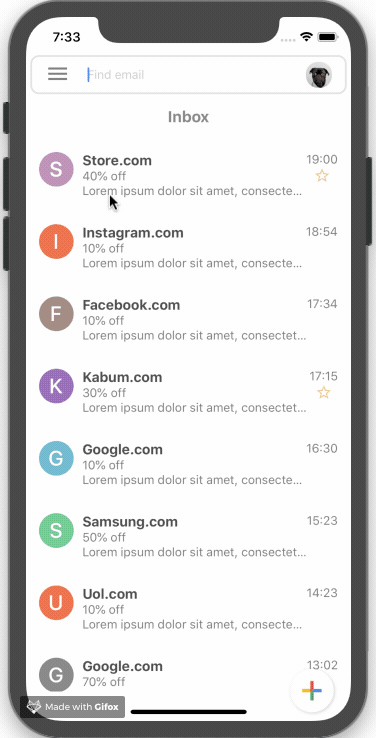

# prototypeEmail
prototype based in gmail of google

## Getting Started

to run the application on your computer you must have installed some packages

### Prerequisites

  - React-native
    ```
      npm install -g react-native-cli
    ```

  - Nodejs
    ```
      https://nodejs.org/en/download/
    ```

  - Android Studio
    ```
      https://developer.android.com/studio
    ```

  - Xcode
    ```
      https://developer.apple.com/xcode/
    ```

### Installing


Here is the step by step that should be followed to run your application once you have installed the prerequisites:

 install the dependencies:
```
npm i
```
Linking gives you a general interface to interact with both incoming and outgoing app links.
```
 react-native link
```
 run:
```
react-native run-android/run-ios
```
### Demo


